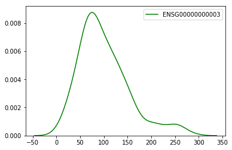

```python
import seaborn as sns
import pandas
import gripql
conn = gripql.Connection("https://bmeg.io/api", credential_file="bmeg_credentials.json")
O = conn.graph("bmeg_rc2")
```

Download gene expression values from TCGA-READ cohort and build matrix with submitter id as label


```python
c = O.query().V("Project:TCGA-READ").out("cases").out("samples").as_("sample")
c = c.out("aliquots").out("gene_expressions").as_("exp")
c = c.render( ["$sample._data.gdc_attributes.submitter_id", "$exp._data.values"])

data = {}
for row in c.execute(stream=True):
    data[row[0]] = row[1]
```

    [INFO]	2019-07-26 18:25:17,143	177 results received in 34 seconds


Take the data we downloaded and turn it into a Pandas data frame


```python
samples = pandas.DataFrame(data).transpose().fillna(0.0)
```

Take a look at the top corner of the dataframe


```python
samples.iloc[:5,:5]
```


<div>
<style scoped>
    .dataframe tbody tr th:only-of-type {
        vertical-align: middle;
    }

    .dataframe tbody tr th {
        vertical-align: top;
    }

    .dataframe thead th {
        text-align: right;
    }
</style>
<table border="1" class="dataframe">
  <thead>
    <tr style="text-align: right;">
      <th></th>
      <th>ENSG00000000003</th>
      <th>ENSG00000000005</th>
      <th>ENSG00000000419</th>
      <th>ENSG00000000457</th>
      <th>ENSG00000000460</th>
    </tr>
  </thead>
  <tbody>
    <tr>
      <th>TCGA-AG-3883-01A</th>
      <td>56.417170</td>
      <td>0.532873</td>
      <td>25.468040</td>
      <td>1.398758</td>
      <td>2.519876</td>
    </tr>
    <tr>
      <th>TCGA-DC-6158-01A</th>
      <td>213.685187</td>
      <td>1.031829</td>
      <td>151.992725</td>
      <td>7.119824</td>
      <td>8.481721</td>
    </tr>
    <tr>
      <th>TCGA-EI-6507-01A</th>
      <td>25.749271</td>
      <td>0.000000</td>
      <td>40.100776</td>
      <td>7.127823</td>
      <td>6.484232</td>
    </tr>
    <tr>
      <th>TCGA-AF-3913-01A</th>
      <td>254.599210</td>
      <td>4.348810</td>
      <td>119.589229</td>
      <td>4.213013</td>
      <td>7.268218</td>
    </tr>
    <tr>
      <th>TCGA-EI-6883-01A</th>
      <td>75.138424</td>
      <td>0.406882</td>
      <td>95.234971</td>
      <td>5.180626</td>
      <td>3.090609</td>
    </tr>
  </tbody>
</table>
</div>


Take a quick look to see the top expressing samples for the gene `ENSG00000000003`


```python
samples["ENSG00000000003"].sort_values(ascending=False).head()
```


    TCGA-DC-5869-01A    281.005900
    TCGA-DC-6683-01A    258.010380
    TCGA-AF-3913-01A    254.599210
    TCGA-EF-5831-01A    253.774315
    TCGA-DC-6157-01A    251.170374
    Name: ENSG00000000003, dtype: float64


```python
sns.kdeplot(samples['ENSG00000000003'], color="g")
```


    <matplotlib.axes._subplots.AxesSubplot at 0x7fd0990397b8>




