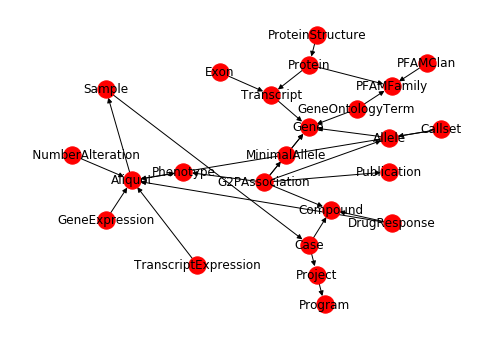

The GripQL API allows a user to download the schema of a graph. This outlines the different types of nodes, the edges the connect them and the structure of the documents stored in graph elements. A graph document has a `graph` field that has the name, a `vertices` field and an `edges` field.

```json
{"graph': "bmeg_rc1_2",
 "vertices': [{"gid": "Compound",
   "label": "Compound",
   "data": {"name": "STRING", "term": "STRING", "term_id": "STRING"}},
  ...],
  "edges": [{"gid": "(Project)--InProgram->(Program)",
   "label": "InProgram",
   "from": "Project",
   "to": "Program",
   "data": {}},
```

Connect to BMEG server


```python
import networkx as nx
import matplotlib.pyplot as plt
import gripql
from networkx.drawing.nx_agraph import graphviz_layout
```


```python
conn = gripql.Connection("http://grip.compbio.ohsu.edu")
```

Print avalible graphs


```python
print(conn.listGraphs())
```

    ['bmeg_test', 'bmeg_rc1', 'pc10', 'bmeg_rc1_2', 'bmeg_test__schema__', 'bmeg_rc1__schema__', 'pc10__schema__', 'bmeg_rc1_2__schema__']


```python
O = conn.graph("bmeg_rc1_2")
```

Get the schema graph


```python
schema = conn.getSchema("bmeg_rc1_2")
```

Start build graph using [NetworkX](https://networkx.github.io/)


```python
g = nx.MultiDiGraph()
```


```python
for v in schema['vertices']:
    g.add_node(v['gid'])
for e in schema['edges']:
    g.add_edge(e['from'], e['to'])
```

Draw Schema Graph


```python
pos = graphviz_layout(g, prog='twopi', args='')
fig, ax = plt.subplots(1, 1, figsize=(8, 6));
nx.draw(g, pos, ax=ax, with_labels=True)
```





```python

```
